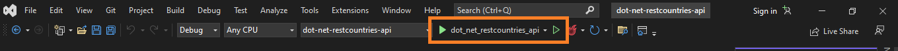
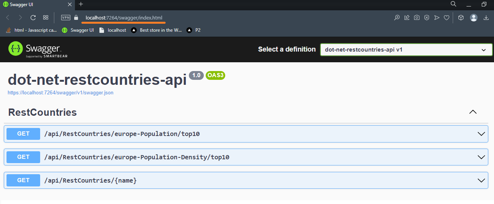
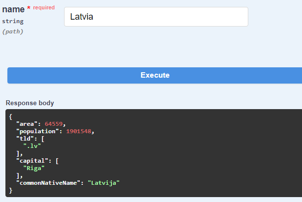
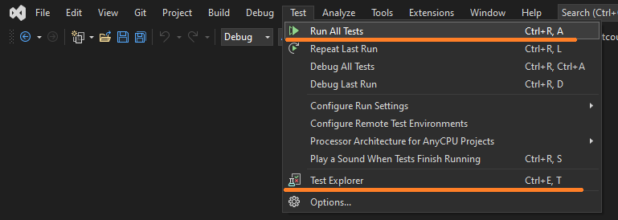

# dot-net-restcountries-api

An ASP.NET Core Web API .NET 6 application which uses the REST Countries API. In this project we get only European Union countries.

### To run your program:

If you are new to .NET visit [microsoft.com](https://dotnet.microsoft.com/en-us/learn)

1. You need to clone or download project from GitHub [project page](https://github.com/kristaps-m/dot-net-restcountries-api)
2. You need the .NET Framework and an IDE (integrated development environment) to work with the C# language. [Try this page to get started.](https://www.simplilearn.com/c-sharp-programming-for-beginners-article)
3. Open and run project with capable IDE of your choice. I used Visual Studio in example below.

4. Visual Studio opens browser window automaticaly with Swagger project page or go 
[https://localhost:7264/swagger/index.html](https://localhost:7264/swagger/index.html)

5. To use restcountries API, click on 'GET' --> 'Try it out' --> 'Execute'. For last one, where you see '{name}' enter country name before you click 'Execute'.
6. Results will show in JSON format. For the last GET request, if you enter 'America', you will see an error message. Remember that you can find only European Union country.

Error!

7. If you want to run tests, go back to your Visual Studio. In picture below you can see how to run them.

### Tools used :wrench: :hammer::

click to open

###### Refit

[https://github.com/reactiveui/refit](https://github.com/reactiveui/refit)

[https://code-maze.com/using-refit-to-consume-apis-in-csharp/](https://code-maze.com/using-refit-to-consume-apis-in-csharp/)

[https://www.c-sharpcorner.com/article/making-faster-api-calls-using-refit-rest-library/](https://www.c-sharpcorner.com/article/making-faster-api-calls-using-refit-rest-library/)

###### Json

[https://json2csharp.com/ ](https://json2csharp.com/)

[https://codebeautify.org/jsonviewer ](https://codebeautify.org/jsonviewer)

###### Filter and sort

[https://dotnettutorials.net/lesson/linq-orderbydescending-method/ ](https://dotnettutorials.net/lesson/linq-orderbydescending-method/)

[https://learn.microsoft.com/en-us/dotnet/api/system.linq.enumerable.take?view=net-7.0 ](https://learn.microsoft.com/en-us/dotnet/api/system.linq.enumerable.take?view=net-7.0)

###### Testing

[https://learn.microsoft.com/en-us/dotnet/standard/serialization/system-text-json/how-to?pivots=dotnet-6-0 ](https://learn.microsoft.com/en-us/dotnet/standard/serialization/system-text-json/how-to?pivots=dotnet-6-0)

[https://github.com/moq/Moq.AutoMocker ](https://github.com/moq/Moq.AutoMocker)

